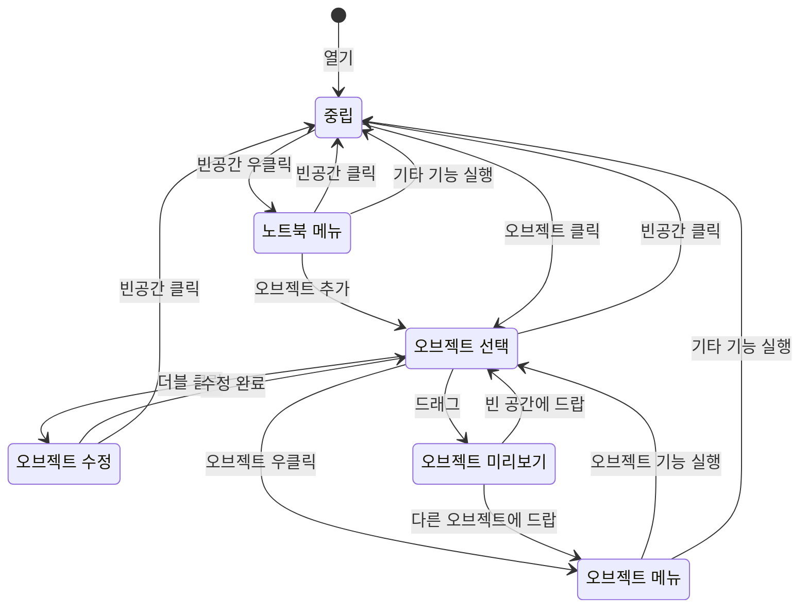

# 사용자 매뉴얼

## 노트북 상태

<figure>

<figcaption>

[노트북상태관리][1]

</figcaption>
</figure>

Mermaid 버전

## 참고

### 외부 링크

1. [노트북 상태관리][1]

[1]: https://www.figma.com/board/aR9QaELgTdhOUnaIHNK5pt/%EB%85%B8%ED%8A%B8%EB%B6%81-%EC%83%81%ED%83%9C%EA%B4%80%EB%A6%AC