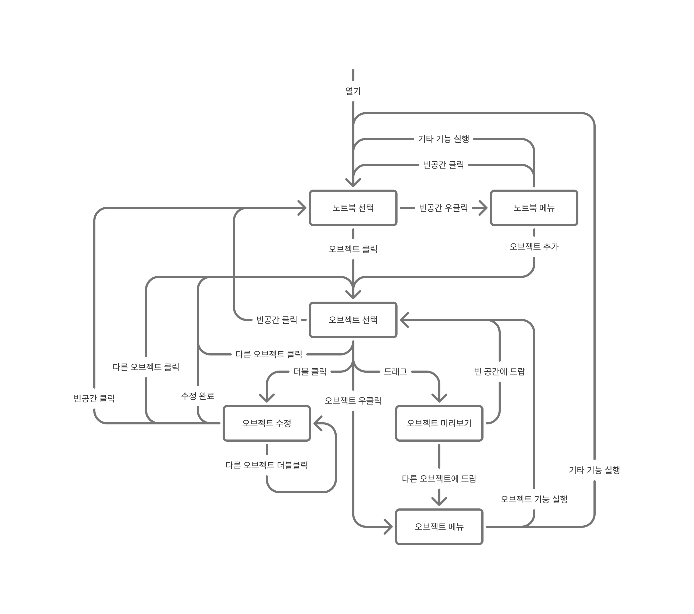

# 사용자 매뉴얼

## 노트북 상태([`Context`][3])

노트북 상태에 따라 사용자가 쓸 수 있는 기능이 달라진다. 노트북은 다음과 같은 상태를 가진다.

<figure>

<figcaption>

[노트북상태관리][1]

</figcaption>
</figure>

Mermaid 버전

### 노트북 선택(`NotebookFocusedContext`)

노트북 오브젝트를 아무것도 선택되지 않은 상태이다. 노트북 메뉴를 열거나 오브젝트를 선택할 수 있다.

### 노트북 메뉴(`NotebookMenuContext`)

노트북의 빈 공간을 우클릭 해서 메뉴를 연 상태이다. 메뉴는 새 오브젝트 추가나 노트북 자체를 수정하는 기능을 제공한다. 메뉴를 닫으려면 빈 공간을 클릭하거나 기타 기능을 실행하면 된다.

### 오브젝트 선택(`ObjectFocusedContext`)

특정 오브젝트를 선택한 상태. 특정 오브젝트를 조작하기 위한 기본 상태이다.

오브젝트를 더블 클릭하면 수정 상태로 전환된다. 오브젝트를 우클릭하면 오브젝트 메뉴가 열린다. 빈 공간을 클릭하면 선택이 해제된다.

드래그 & 드랍으로 이동하거나 오브젝트 메뉴를 열 수 있다.

### 오브젝트 수정(`ObjectEditContext`)

오브젝트를 수정하는 상태이다. 오브젝트의 내용 등을 변경할 수 있다. 수정이 완료되면 오브젝트 선택 상태로 돌아간다. 빈 공간을 클릭하면 선택이 해제된다.

### 오브젝트 미리보기(`ObjectPreviewContext`)

오브젝트를 드래그하는 도중의 상태이다. 오브젝트를 빈 공간에 드랍하면 오브젝트의 위치를 옮기고 오브젝트 선택 상태로 돌아간다. 다른 오브젝트에 드랍하면 오브젝트 메뉴가 열린다.

### 오브젝트 메뉴(`ObjectMenuContext`)

오브젝트의 메뉴를 연 상태이다.

오브젝트를 우클릭하거나 다른 오브젝트에 드랍해서 열 수 있다. 오브젝트 한정 기능이나 기타 기능을 실행할 수 있다.

## 참고

### 외부 링크

1. [노트북 상태관리][1]
2. [유한 상태 기계][2]
3. [`kr.lul.stringnotebook.state.organism.Context`][3]

[1]: https://www.figma.com/board/aR9QaELgTdhOUnaIHNK5pt/%EB%85%B8%ED%8A%B8%EB%B6%81-%EC%83%81%ED%83%9C%EA%B4%80%EB%A6%AC
[2]: https://ko.wikipedia.org/wiki/%EC%9C%A0%ED%95%9C_%EC%83%81%ED%83%9C_%EA%B8%B0%EA%B3%84
[3]: ../state/src/commonMain/kotlin/kr/lul/stringnotebook/state/organism/Context.kt