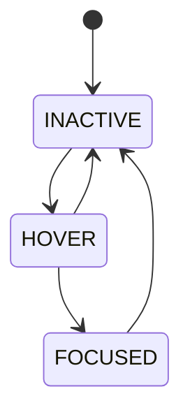

# `:state`

UI 상태 홀더.

## 상태

노트북 오브젝트는 사용자 조작에 따라 상태를 가지고 있으며, 상태에 따라 UI와 사용할 수 있는 기능이 달라진다.

```mermaid
stateDiagram-v2
    [*] --> INACTIVE
    INACTIVE --> HOVER
    HOVER --> INACTIVE
    HOVER --> FOCUSED
    FOCUSED --> INACTIVE
```